# SDK Feedback

The feedback SDK surface provides operations for creating, transitioning, querying, and resolving [feedback](../01-concepts/03-data-model.md#feedback) on governed artefacts. Feedback lives in the [Archivist](../02-flow/04-system-services.md#archivist), scoped to Workitem ID and artefact `id`. All feedback operations are routed through the [Sidecar](../03-node/01-sidecar.md) to the Archivist; the Archivist enforces state machine validity, capability requirements, and the [contempt guard](#contempt-guard-behaviour).

## Feedback Friction

Every `AddFeedback` call transparently emits an [`AddFriction`](./06-sdk-telemetry.md#addfriction-node-context) event. The node does not call `AddFriction` separately for feedback — the SDK handles it.

The magnitude equals the feedback depth for that item on that artefact. The first feedback on an item emits magnitude 1, the second emits 2, the nth emits n. Friction is attributed to the Workitem and the current node.

This creates a naturally escalating cost signal. Early feedback is cheap. Repeated rounds of disagreement on the same item become progressively more expensive, making the cost of the adversarial loop visible before it reaches deadlock.

The friction emission is transparent and mandatory — nodes cannot suppress it. The node's `AddFeedback` call succeeds or fails on its own merits; the friction event is a side effect published to the [Flow Event Bus](../02-flow/04-system-services.md#flow-event-bus).

## Feedback Query Surfaces

Feedback is accessed through the [Artefact](./02-sdk-artefacts.md) object, not through the [Workitem](./05-sdk-workitems.md) snapshot.

| Operation | Returns |
|-----------|---------|
| `GetFeedback(artefactId)` | All feedback items for the specified artefact, across all versions. |
| `HasUnresolvedFeedback(artefactId)` | `true` if any feedback item on the artefact is in a non-`resolved` state. |
| `GetFeedbackDepth(feedbackId)` | The current history depth (number of transitions) for the specified feedback item. |

Feedback items are tagged with the artefact version hash they were raised against. All feedback is preserved across versions — storing new content does not discard or invalidate existing feedback.

From the gate node's perspective, only `resolved` feedback is settled. Feedback in any other state — `new`, `actioned`, `wont_fix`, `rejected`, `deadlocked` — is unresolved and blocks the Workitem from exiting. An `actioned` item still needs reviewer verification; a `wont_fix` item still needs reviewer acceptance or dispute. `HasUnresolvedFeedback` reflects this definition.

## Feedback State Transitions

Feedback follows a strict state machine. The [Archivist](../02-flow/04-system-services.md#archivist) enforces these transitions — any state change outside this state machine is rejected.

```mermaid
stateDiagram-v2
    [*] --> new : AddFeedback()

    new --> actioned : ResolveFeedback()
    new --> wont_fix : RefuseFeedback()<br/>with Justification

    actioned --> resolved : AcceptFix()
    actioned --> rejected : RejectFix()

    wont_fix --> resolved : AcceptRefusal()
    wont_fix --> rejected : RejectRefusal()
    new --> deadlocked : DeadlockFeedback()

    actioned --> deadlocked : DeadlockFeedback()

    wont_fix --> deadlocked : DeadlockFeedback()

    rejected --> actioned : ResolveFeedback()
    rejected --> wont_fix : RefuseFeedback()<br/>with Justification
    rejected --> deadlocked : DeadlockFeedback()

    deadlocked --> wont_fix : Arbiter verdict<br/>(favours refiner;<br/>linkedRuling set)
    deadlocked --> rejected : Arbiter verdict<br/>(favours reviewer;<br/>linkedRuling set)

    resolved --> [*]
```

| Operation | From State | To State | Actor | Required Payload |
|-----------|-----------|----------|-------|-----------------|
| `AddFeedback(artefactId, severity, message)` | — | `new` | Any node with capability | `severity` (enum), `message` (string, max 1024 chars) |
| `ResolveFeedback(feedbackId, message)` | `new`, `rejected` | `actioned` | Refining node | `message` describing the fix applied |
| `RefuseFeedback(feedbackId, justification)` | `new`, `rejected` | `wont_fix` | Refining node | Structured [justification](#refusal-and-justification-contract) (required) |
| `AcceptFix(feedbackId)` | `actioned` | `resolved` | Reviewing node | — |
| `RejectFix(feedbackId, message)` | `actioned` | `rejected` | Reviewing node | `message` explaining why the fix is inadequate |
| `AcceptRefusal(feedbackId)` | `wont_fix` | `resolved` | Reviewing node | — |
| `RejectRefusal(feedbackId, message)` | `wont_fix` | `rejected` | Reviewing node | `message` explaining why the refusal is unjustified |
| `DeadlockFeedback(feedbackId)` | `new`, `actioned`, `wont_fix`, `rejected` | `deadlocked` | Gate node | — |

The **Actor** column describes the expected role in the [reference arrangement](../01-concepts/02-foundry-cycle.md), not an enforced identity constraint. Any node holding the required `WRITE:feedback/<status>` [capability](../03-node/02-configuration.md) can call the corresponding operation. The Archivist validates the capability grant and the from-state; node identity is recorded in each `FeedbackEvent` for audit, not for access control.

The gate node queries feedback depth via `GetFeedbackDepth(feedbackId)` and determines whether escalation is warranted. When the gate node decides to escalate, it calls `DeadlockFeedback(feedbackId)` to transition the feedback item to `deadlocked`, then returns a routing instruction to send the Workitem to the [Arbiter](../02-flow/03-nodes-external.md#the-judiciary--standard-subsystem). The Archivist validates the `WRITE:feedback/deadlocked` capability, the from-state (any state except `resolved` and `deadlocked`), and the contempt guard (`linkedRuling` blocks deadlock) — deadlock determination is gate node logic, not Archivist enforcement. The Arbiter fans out to [Juror nodes](../01-concepts/02-foundry-cycle.md#juror-judicial-agent) for deliberation, tallies verdicts internally, and on consensus drives a [Clerk cycle](../01-concepts/02-foundry-cycle.md#clerk-cycle) child that drafts the Tier 2 Ruling as a [petition](../01-concepts/02-foundry-cycle.md#petition-artefact). The feedback item is then transitioned to either `wont_fix` (favouring the refiner) or `rejected` (favouring the reviewer), with the `linkedRuling` field set to the Ruling that captures the decision.

Each transition appends a `FeedbackEvent` to the item's history — an append-only chronological record of who acted, what action they took, and what they said.

Severity signals urgency, not authority:

| Severity | Description |
|----------|-------------|
| `LOW` | Minor style or preference issue |
| `MEDIUM` | Quality issue that should be addressed |
| `HIGH` | Functional or security concern |
| `CRITICAL` | Blocking issue, potential data loss |

## Refusal and Justification Contract

When a node calls `RefuseFeedback`, it must provide a structured justification. Unstructured refusals are rejected.

| Type | Fields | Meaning |
|------|--------|---------|
| `citation` | `citationIds[]` | "Existing law supports my position." The node cites specific laws that justify refusing the feedback. |
| `novel_argument` | `argument` (string) | "Here is a new argument." The node proposes reasoning not yet captured in the Library. |

Every refusal creates a traceable governance record — either a link to existing law or a new argument that can itself become a Tier 1 [Finding](../01-concepts/03-data-model.md#law-tiers) if it proves valuable.

The forced-choice structure prevents drive-by refusals. A node cannot dismiss feedback without either pointing to governance that supports its position or articulating a new principle for the record.

## Deadlock and Arbiter Interaction

When the gate node determines that a feedback item's history depth warrants escalation, it calls `DeadlockFeedback(feedbackId)` to transition the item to `deadlocked`, then returns a routing instruction to send the Workitem to the [Arbiter](../02-flow/03-nodes-external.md#the-judiciary--standard-subsystem). The threshold applies per feedback item, not per Workitem — a Workitem can have dozens of feedback items cycling normally while a single contentious item triggers escalation.

The Arbiter fans out to [Juror nodes](../01-concepts/02-foundry-cycle.md#juror-judicial-agent) for multi-agent deliberation and tallies juror verdicts internally. On consensus (or after HITL resolution of a hung jury), the verdict flows into the [Clerk cycle](../01-concepts/02-foundry-cycle.md#clerk-cycle) to draft a Tier 2 Ruling as a [petition](../01-concepts/02-foundry-cycle.md#petition-artefact). The Arbiter renders the verdict:

- **Verdict favours refiner** — the feedback state is set to `wont_fix` with `linkedRuling` pointing to the Tier 2 Ruling drafted through the [Clerk cycle](../01-concepts/02-foundry-cycle.md#clerk-cycle). The reviewing node must call `AcceptRefusal()`.
- **Verdict favours reviewer** — the feedback state is set to `rejected` with `linkedRuling` pointing to the Tier 2 Ruling. The refining node must call `ResolveFeedback()` to comply.

In both cases, [Juror deliberation friction](../01-concepts/03-data-model.md#friction) is emitted: each deliberation round produces friction at magnitude `depth ^ (round + 1)`. If the Arbiter exhausts its deliberation rounds and routes to a [HITL node](../04-sdk/08-sdk-hitl.md) for human intervention, a single friction event is emitted at magnitude `depth ^ (rounds * 2)`.

Handlers should respond to post-Arbiter feedback items by checking `linkedRuling`. A non-empty `linkedRuling` means judicial mandate is in effect and the [contempt guard](#contempt-guard-behaviour) constrains available transitions.

## Contempt Guard Behaviour

Once the [Arbiter](../02-flow/03-nodes-external.md#the-judiciary--standard-subsystem) renders a verdict and sets `linkedRuling` on a feedback item, the [Archivist](../02-flow/04-system-services.md#archivist) enforces judicial finality:

- `wont_fix` with `linkedRuling` — the only valid next transition is `resolved` via `AcceptRefusal()`. The reviewing node must accept the verdict. Attempting `RejectRefusal()` or `DeadlockFeedback()` returns `CONTEMPT_VIOLATION`.
- `rejected` with `linkedRuling` — the only valid next transition is `actioned` via `ResolveFeedback()`, then to `resolved` via `AcceptFix()`. The refining node must comply with the ruling. Attempting `RefuseFeedback()` or `DeadlockFeedback()` returns `CONTEMPT_VIOLATION`.
- Any state with `linkedRuling` — `DeadlockFeedback()` is blocked regardless of the item's current state. Re-escalation of a judicially resolved dispute returns `CONTEMPT_VIOLATION`.

`CONTEMPT_VIOLATION` is a permanent rejection, not a retriable error. The ruling is not a suggestion — the losing side must accept the verdict. The contempt guard is enforced by the Archivist regardless of node identity, capability grants, or topology. No node, including the Judiciary nodes, can override a ruling once applied to a feedback item.

## Store and Link Pattern

Feedback messages are capped at 1024 characters. For detailed analysis that exceeds this limit, use the Store & Link pattern:

1. Store the full analysis as an artefact using [`StoreArtefact`](./02-sdk-artefacts.md#write-and-versioning-operations).
2. Reference the artefact `id` in the feedback message.

The artefact carries the detail; the feedback message carries the pointer. The analysis artefact participates in normal versioning and provenance, making the full reasoning permanently auditable.

## Capability and Error Semantics

Feedback operations map to capability requirements:

| Operation | Required Capability | Enforcing Service |
|-----------|-------------------|-------------------|
| `AddFeedback` | `WRITE:feedback/new` | Archivist |
| `ResolveFeedback` | `WRITE:feedback/actioned` | Archivist |
| `RefuseFeedback` | `WRITE:feedback/wont_fix` | Archivist |
| `AcceptFix`, `AcceptRefusal` | `WRITE:feedback/resolved` | Archivist |
| `RejectFix`, `RejectRefusal` | `WRITE:feedback/rejected` | Archivist |
| `DeadlockFeedback` | `WRITE:feedback/deadlocked` | Archivist |
| `GetFeedback`, `HasUnresolvedFeedback`, `GetFeedbackDepth` | `READ:feedback` | Archivist |

Common error conditions:

| Error | Cause |
|-------|-------|
| `CAPABILITY_DENIED` | Node lacks the required capability for the operation |
| `INVALID_STATE_TRANSITION` | Requested transition is not permitted from the current state |
| `CONTEMPT_VIOLATION` | Attempt to override a judicial ruling (`linkedRuling` set) |
| `FEEDBACK_NOT_FOUND` | Specified feedback ID does not exist on the artefact |
| `MESSAGE_TOO_LONG` | Message exceeds 1024 character limit |

All errors are structured and carry stable error codes. Full error semantics are in the [Error Catalogue](../05-reference/error-catalogue.md).

## Feedback SDK Invariants

1. Feedback is scoped to Workitem ID + artefact `id` and persisted by the [Archivist](../02-flow/04-system-services.md#archivist).
2. Feedback is tagged with the artefact version hash it was raised against and preserved across versions.
3. The Archivist enforces state machine transitions — only the transitions listed above are permitted.
4. `RefuseFeedback` requires a structured [justification](#refusal-and-justification-contract) (citation or novel argument).
5. The [contempt guard](#contempt-guard-behaviour) is absolute — `CONTEMPT_VIOLATION` is a permanent rejection.
6. Every `AddFeedback` call transparently emits friction at magnitude equal to feedback depth.
7. Only `resolved` is a terminal state; all other states are unresolved from the gate node's perspective.
8. Deadlock detection is per feedback item, not per Workitem.
9. Feedback history is append-only — the investigative record cannot be rewritten.
10. Feedback messages are capped at 1024 characters; detailed analysis uses the Store & Link pattern.
