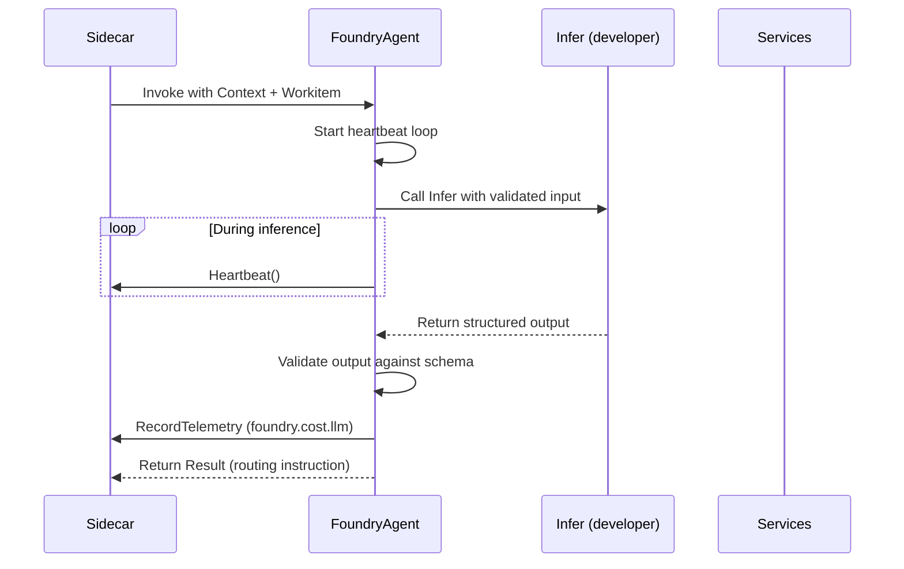

# SDK Agent

FoundryAgent is the SDK's managed wrapper for inference workloads. It automates heartbeat management, validates structured output against a declared schema, and emits cost telemetry atomically per inference step. FoundryAgent is the recommended pattern for all LLM-backed nodes and the runtime powering the [Jury](../02-flow/04-system-services.md#jury) service's multi-agent deliberation mechanism.

## FoundryAgent Runtime Role

FoundryAgent sits between the [handler contract](./01-sdk-core.md#handler-lifecycle-contract) and the inference execution. Where a raw handler receives a `Context` and `Workitem` and must manually manage heartbeat signals, output validation, and telemetry emission, FoundryAgent wraps the inference call with automated lifecycle management.

The developer implements an `Infer` method — the inference-specific business logic — and FoundryAgent handles the surrounding operational contract:



FoundryAgent does not introduce new gRPC surface. It wraps existing SDK operations — [`Heartbeat()`](./01-sdk-core.md#heartbeat-and-activity-tracking) and [`RecordTelemetry()`](./06-sdk-telemetry.md) — into a managed lifecycle around the developer's inference logic.

## Behavioural Guarantees

FoundryAgent provides three invariants that hold for every inference invocation:

### Managed Liveness

FoundryAgent calls [`Heartbeat()`](./01-sdk-core.md#heartbeat-and-activity-tracking) at regular intervals during inference execution. The heartbeat loop starts before the `Infer` method is called and stops after it returns. The developer does not manage timers, background threads, or heartbeat scheduling.

The heartbeat interval is configured to provide margin within the node's [inactivity timeout](../03-node/01-sidecar.md#heartbeat-and-activity-tracking). The wrapper ensures that even long-running inference steps — multi-minute LLM calls, iterative chain-of-thought loops — do not trigger timeout termination as long as the underlying process is alive.

### Schema-First Output Validation

FoundryAgent validates structured output against a declared schema before the output can be written to artefacts or returned as a routing decision. The schema is declared at FoundryAgent construction time.

If the inference output does not conform to the schema, FoundryAgent rejects the output immediately. The handler receives a structured validation error. Malformed inference output fails fast — it never enters the governed pipeline, never produces artefact versions, and never influences routing decisions.

Schema validation is output-side only. FoundryAgent does not validate the input to `Infer` beyond what the standard [handler contract](./01-sdk-core.md#handler-lifecycle-contract) provides. Input shaping (prompt construction, context assembly) is the developer's responsibility.

### Atomic Cost Accounting

Each inference step emits a `foundry.cost.llm` telemetry event immediately via [`RecordTelemetry()`](./06-sdk-telemetry.md). The event is emitted after each inference call returns, before any subsequent processing. If the handler is interrupted — by timeout, pod eviction, or cancellation — the accounting record reflects actual work performed up to the point of interruption, not batched totals emitted at handler exit.

The `foundry.cost.llm` event carries structured cost data:

| Field | Purpose |
|-------|---------|
| `model` | The model identifier used for the inference call |
| `input_tokens` | Number of tokens in the inference input |
| `output_tokens` | Number of tokens in the inference output |
| `duration_ms` | Wall-clock duration of the inference call in milliseconds |

These fields are behavioural conventions, not a rigid schema. Implementations may include additional fields (e.g. `provider`, `cached_tokens`, `reasoning_tokens`) as the payload is a structured [custom telemetry event](./06-sdk-telemetry.md#telemetry-surface-overview) subject to the standard 64 KB limit. The [Sidecar](../03-node/01-sidecar.md) wraps the event in the standard telemetry envelope with identity context.

## Handler Contract

A FoundryAgent handler differs from a raw handler in a single structural way: the developer implements an `Infer` method instead of the top-level handler entry point.

**Raw handler** — the developer:

1. Receives `Context` and `Workitem`.
2. Manages heartbeat manually for long-running computation.
3. Performs inference.
4. Validates output manually.
5. Emits cost telemetry manually.
6. Returns a `Result`.

**FoundryAgent handler** — the developer:

1. Declares an output schema at construction time.
2. Implements `Infer` — receives validated input, performs inference, returns structured output.
3. Returns a `Result` based on the validated output.

FoundryAgent handles steps 2, 4, and 5 from the raw handler list automatically. The `Infer` method is the sole extension point.

Multiple inference steps within a single assignment are supported. Each step independently emits a `foundry.cost.llm` event and resets the heartbeat timer. A handler that chains multiple LLM calls (e.g. generate, self-critique, revise) emits one cost event per call, preserving per-step accounting granularity.

## Model and Provider Architecture

### Model Interface

FoundryAgent performs inference through a `Model` — a single-method interface that encapsulates both the model identity and the transport backend:

```go
type Model interface {
    Infer(ctx context.Context, systemPrompt string, queryPrompt []byte) (*InferOutput, error)
}
```

`Model` is the sole abstraction the developer interacts with for inference. There is no separate provider interface, no model ID parameter, and no deploy-time model selection. The model choice is a code-time decision — prompts are intrinsically coupled to the model they were built and tested with.

### Concrete Model Types

Each supported model is a concrete type whose name encodes both the model and the provider backend that serves it:

| Type | Model ID | Provider |
|------|----------|----------|
| `GptOss120bOllama` | `gpt-oss:120b-cloud` | Ollama |
| `KimiK2Ollama` | `kimi-k2.5:cloud` | Ollama |

Construction is a zero-argument call. Infrastructure configuration (endpoint URLs, timeouts) is handled internally by the provider via environment variables:

```go
model := flow.NewGptOss120bOllama()
model := flow.NewKimiK2Ollama()
```

The naming convention is `{Model}{Provider}`. The same underlying model served by different providers (e.g. Ollama vs OpenRouter) would be distinct types — different providers have different cost profiles, API behaviours, and prompt formatting requirements.

### Provider Encapsulation

The provider layer is fully internal to the SDK. Consumers never see, create, or configure providers directly. Each concrete model type creates and owns its provider instance. The `provider` interface and its implementations are unexported.

This encapsulation means:

- **No provider wiring in node code** — nodes do not call `NewOllamaProvider()` or pass providers to constructors. The concrete model type handles this internally.
- **No model ID in configuration** — the model identifier is hardcoded in the concrete type, not read from ConfigMaps or environment variables. Model selection is a source code decision validated at compile time.
- **Cost metadata flows from the provider** — `CostMetadata.Model` (populated by the provider at inference time) carries the model identity at runtime. There is no `ID()` method on the `Model` interface because this would be redundant with the provider-sourced cost data.

### Model Ownership in Agents

Concrete agents create their model internally during construction. The caller never supplies or sees the model:

```go
// Inside a concrete agent constructor:
func NewForgeAgent(...) *ForgeAgent {
    agent := flow.NewAgent(
        flow.WithModel(flow.NewGptOss120bOllama()),
        // ...
    )
    return &ForgeAgent{agent: agent}
}
```

This keeps the model choice co-located with the prompts that depend on it. Changing the model requires changing the agent code — which is correct, because the prompts would need updating too.

### Test Injection

Tests replace the model after construction using the exported escape hatch:

```go
flow.OverrideModelForTest(agent.agent, mockModel)
```

`OverrideModelForTest` is named to make misuse in production code obvious. It sets the model on an `Agent` instance directly. The function is exported for cross-package test access while the `model` field on `Agent` remains unexported.

## When to Use FoundryAgent

**Recommended for:**

- All LLM-backed nodes — inference nodes benefit from managed heartbeat, output validation, and automatic cost accounting without manual instrumentation.
- Multi-step inference chains — nodes that perform sequential LLM calls benefit from per-step cost attribution and continuous heartbeat management.
- Agent nodes with structured output — nodes that produce JSON-schema-constrained output benefit from fail-fast schema validation before artefact writes.

**Not needed for:**

- Deterministic validators — nodes like [Quench](../01-concepts/02-foundry-cycle.md#quench-deterministic-validator) that run rule-based checks without LLM inference. These nodes are fast enough that manual heartbeat management is unnecessary and have no LLM cost to account for.
- Simple routing nodes — nodes like [Sort](../01-concepts/02-foundry-cycle.md#sort-gate) that evaluate state and route without performing inference.
- Nodes with no structured output — nodes that produce only unstructured artefact content gain nothing from schema validation.

Nodes that perform inference without FoundryAgent must manage [`Heartbeat()`](./01-sdk-core.md#heartbeat-and-activity-tracking) calls manually, validate output explicitly, and emit cost telemetry through direct [`RecordTelemetry()`](./06-sdk-telemetry.md) calls. The [Long-Running and Agent Patterns](../03-node/03-patterns.md#long-running-and-agent-patterns) section describes the manual alternative.

## Relationship to the Jury Service

The [Jury](../02-flow/04-system-services.md#jury) service's multi-agent deliberation uses FoundryAgent instances as jurors. Each juror is a FoundryAgent that evaluates a dispute or hearing independently, producing a structured verdict output validated against the Jury's verdict schema.

Cost accounting per juror is automatic. Each juror's `foundry.cost.llm` events carry attribution tags that link the cost to the specific deliberation context:

| Tag | Purpose |
|-----|---------|
| `juror` | Juror identifier within the panel |
| `round` | Deliberation round number |
| `severity` | Severity level of the dispute or hearing |
| `feedback_id` | The feedback item under dispute (for deadlock adjudication) |

These tags are included in the `RecordTelemetry` payload alongside the standard cost fields. The [Friction Ledger](../02-flow/04-system-services.md#friction-ledger) aggregates jury costs per juror, per round, and per dispute — enabling operators to quantify the cost of judicial deliberation and identify expensive dispute patterns.

Parallel juror execution is managed by the Jury service internally. Each juror's FoundryAgent instance maintains its own heartbeat loop and cost accounting independently. The jury mechanism does not require special SDK surface — it is a composition of FoundryAgent instances within the Jury service's deliberation engine.

## FoundryAgent Invariants

1. Managed heartbeat runs continuously during `Infer` execution. The developer never manages heartbeat timers manually.
2. Output schema validation is mandatory. Inference output that does not conform to the declared schema is rejected before it can affect artefact state or routing.
3. Cost telemetry is emitted atomically per inference step. Interrupted handlers reflect actual work performed.
4. FoundryAgent introduces no new gRPC surface. It wraps existing `Heartbeat()` and `RecordTelemetry()` calls.
5. The `Infer` method is the sole developer extension point. Heartbeat, validation, and cost accounting are wrapper-managed.
6. Multiple inference steps within a single assignment are independently accounted and heartbeat-managed.
7. Jury service jurors are FoundryAgent instances. Per-juror cost attribution is automatic through telemetry tags.
8. Model selection is a code-time decision. Concrete agents create their model internally. The provider layer is unexported and invisible to consumers.
