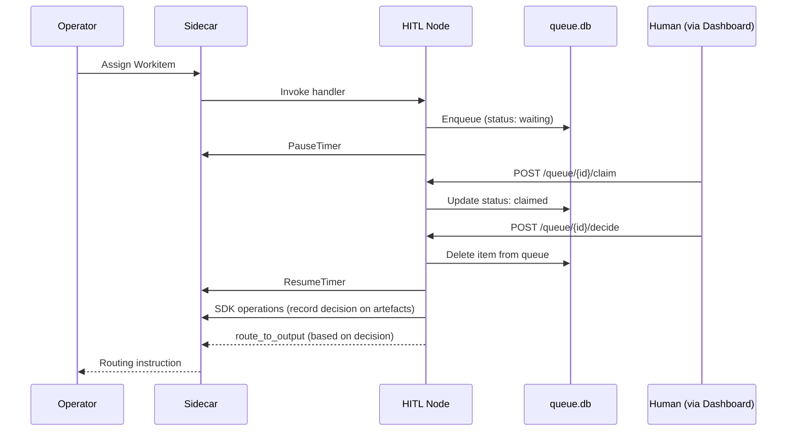
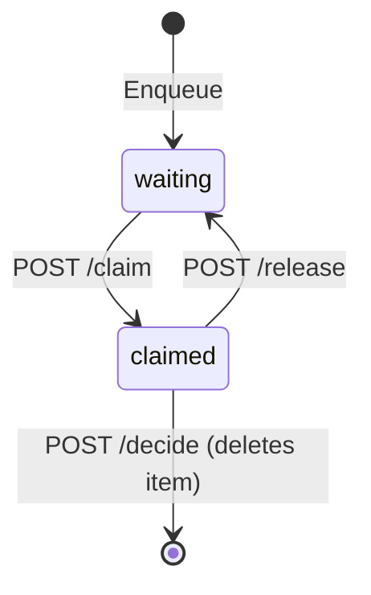
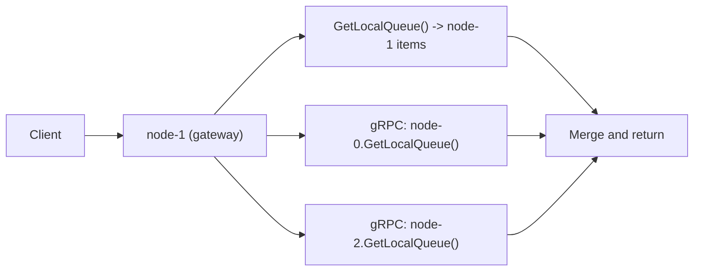

# SDK HITL

The HITL (Human-in-the-Loop) SDK surface provides managed infrastructure for nodes that require human decisions during Workitem processing. Any node can become an HITL node by declaring the `USE:queue/server` [capability](../03-node/02-configuration.md#capability-grants) and configuring persistent storage. The SDK provides queue management, REST API exposure, persistence, and the Federated Queue Mesh for horizontal scaling.

The Judiciary's [Advocate](../02-flow/03-nodes-external.md#the-judiciary--standard-subsystem) is a concrete HITL node for judicial escalation. User-defined HITL nodes compose the same SDK pattern with domain-specific decision logic.

## HITL Runtime Role

An HITL node parks a Workitem in a persistent queue while awaiting a human decision. The Workitem remains assigned to the HITL node — it holds assignment ownership and [pauses the Sidecar's inactivity timer](../03-node/01-sidecar.md#heartbeat-and-activity-tracking) to prevent timeout while the item is queued. When a human provides a decision through the REST API, the item is removed from the queue, the node resumes the timer, records the decision on governed artefacts through [SDK operations](./02-sdk-artefacts.md), then returns a routing instruction based on the decision.



## `USE:queue/server` Capability

The `USE:queue/server` capability enables HITL features on a node. When declared, the [Operator](../02-flow/01-operator.md) applies specific provisioning:

| Operator action | Description |
|---|---|
| **StatefulSet deployment** | Deploys the node as a StatefulSet (not ReplicaSet), providing stable pod identity for DNS-based peer discovery. |
| **Headless Service** | Creates a Headless Service (no ClusterIP) for the node, enabling pod-level DNS resolution. |
| **Storage validation** | Rejects nodes declaring `USE:queue/server` without `spec.storage`. Persistent storage is required for queue durability. |

The Operator validates at admission time:

| Condition | Result |
|---|---|
| `USE:queue/server` without `spec.storage` | Rejected — `SCHEMA_VALIDATION_FAILED` |
| `USE:queue/server` with `spec.storage` | StatefulSet deployment, Headless Service created |

## QueueManager Interface

The SDK provides a `QueueManager` interface for nodes using `USE:queue/server`. The QueueManager handles local persistence, peer communication, and proxy routing transparently.

```go
type QueueManager interface {
    // Enqueue adds an item to the local shard's queue.
    Enqueue(ctx context.Context, workitemID string) error

    // GetGlobalQueue returns items from all shards via scatter-gather.
    GetGlobalQueue(ctx context.Context, filter QueueFilter) ([]QueueItem, error)

    // GetLocalQueue returns items from this shard only.
    GetLocalQueue(ctx context.Context, filter QueueFilter) ([]QueueItem, error)

    // GetItem returns a single queue item by Workitem ID. Checks local shard first, then fans out to peers.
    GetItem(ctx context.Context, workitemID string) (*QueueItem, error)

    // Claim marks an item as claimed. Proxied to the owning shard if remote.
    Claim(ctx context.Context, workitemID string) (*QueueItem, error)

    // Release unclaims an item. Proxied to the owning shard if remote.
    Release(ctx context.Context, workitemID string) (*QueueItem, error)

    // Complete removes a claimed item from the queue (decision made). Proxied to the owning shard if remote.
    Complete(ctx context.Context, workitemID string) error

    // GetPeers returns currently connected peer shard IDs.
    GetPeers(ctx context.Context) ([]string, error)
}
```

The QueueManager is available to the node handler when the `USE:queue/server` capability is declared. All queue operations are node-local — the [Sidecar](../03-node/01-sidecar.md) does not mediate the QueueManager or the human-facing REST API. The Sidecar mediates the SDK calls the node makes after receiving human input (artefact writes, feedback transitions, routing instructions).

The queue stores no domain-specific data. Artefact content, feedback, and decisions are managed through existing SDK surfaces (Archivist, Librarian). The queue tracks parking state only — which Workitems are waiting and whether someone has claimed one for review.

## REST API Contract

HITL nodes expose a standard HTTP API for external tooling (dashboards, CLIs, mobile applications). The API is node-owned — the Sidecar does not mediate human-facing traffic.

### Endpoints

| Method | Path | Description |
|---|---|---|
| `GET` | `/queue` | List items in the queue. Supports `status` filter (`waiting`, `claimed`), `limit`, and `offset` for pagination. Scatter-gather across all mesh peers. |
| `GET` | `/queue/{id}` | Get full detail for a specific queue item by Workitem ID. |
| `POST` | `/queue/{id}/claim` | Claim an item for review. Transitions `waiting` to `claimed`. |
| `POST` | `/queue/{id}/decide` | Signal that a decision has been made. Removes the item from the queue. No request body — the decision is expressed through SDK operations (artefact writes, feedback, routing). |
| `POST` | `/queue/{id}/release` | Release a claimed item back to `waiting`. |

### Error Responses

All error responses use a standard JSON envelope with a stable error code from the [Error Catalogue](../05-reference/error-catalogue.md):

```json
{
  "error": {
    "code": "QUEUE_ITEM_NOT_FOUND",
    "message": "queue item not found"
  }
}
```

| Endpoint | HTTP Status | Error Code | Condition |
|---|---|---|---|
| `GET /queue/{id}` | 404 | `QUEUE_ITEM_NOT_FOUND` | Item does not exist on any shard. |
| `POST /queue/{id}/claim` | 404 | `QUEUE_ITEM_NOT_FOUND` | Item does not exist. |
| `POST /queue/{id}/claim` | 409 | `QUEUE_ITEM_ALREADY_CLAIMED` | Item is already in `claimed` state. |
| `POST /queue/{id}/claim` | 503 | `QUEUE_UNAVAILABLE` | Owning shard is unreachable. |
| `POST /queue/{id}/decide` | 404 | `QUEUE_ITEM_NOT_FOUND` | Item does not exist. |
| `POST /queue/{id}/decide` | 409 | `QUEUE_ITEM_INVALID_STATE` | Item is not in `claimed` state. |
| `POST /queue/{id}/decide` | 503 | `QUEUE_UNAVAILABLE` | Owning shard is unreachable. |
| `POST /queue/{id}/release` | 404 | `QUEUE_ITEM_NOT_FOUND` | Item does not exist. |
| `POST /queue/{id}/release` | 409 | `QUEUE_ITEM_INVALID_STATE` | Item is not in `claimed` state. |
| `POST /queue/{id}/release` | 503 | `QUEUE_UNAVAILABLE` | Owning shard is unreachable. |

### State Engine Model

The HITL node is a mechanical queue that tracks parking state. Human identity, assignment mapping, and audit trail correlation are the Dashboard/BFF's responsibility. The queue stores no domain-specific data — artefact content, feedback, and decisions flow through existing SDK surfaces.



| State | Description |
|---|---|
| `waiting` | Item is in the queue, available for claim. |
| `claimed` | Item is locked for review. The Dashboard tracks who claimed it. |

When a decision is made (`POST /decide`), the item is deleted from the queue. The handler unblocks and performs SDK operations (artefact writes, feedback transitions, routing instructions) based on the human's decision.

The separation of concerns is strict:

| Concern | Owner |
|---|---|
| Queue parking state (`waiting`, `claimed`, removal) | HITL Node (QueueManager, SQLite) |
| Human identity (who claimed, who decided) | Dashboard/BFF (external IdP) |
| Assignment mapping (which human has which item) | Dashboard/BFF (its own database) |
| Domain-specific decisions (artefact content, feedback) | SDK operations (Archivist, Librarian) |
| Audit trail with identity correlation | Dashboard/BFF |

## Persistence

The SDK manages a SQLite database at `{storage.mountPath}/queue.db`. The schema is SDK-owned and automatically initialised on first startup.

### Schema

```sql
CREATE TABLE hitl_queue (
    workitem_id TEXT PRIMARY KEY,
    shard_id TEXT NOT NULL,
    status TEXT DEFAULT 'waiting',
    enqueued_at TIMESTAMP DEFAULT CURRENT_TIMESTAMP,
    claimed_at TIMESTAMP
);

CREATE INDEX idx_status ON hitl_queue(status);
CREATE INDEX idx_shard ON hitl_queue(shard_id);
```

The `shard_id` is the pod's stable identity from the StatefulSet (e.g., `review-queue-0`). A Workitem is queued exactly once — the Workitem ID serves as the primary key. REST API clients operate on Workitem IDs — shard identity is a transport-layer detail handled by the QueueManager. The queue stores no domain-specific payload or decision data — these flow through existing SDK surfaces (Archivist for artefacts, feedback; Librarian for laws). When a decision is made, the row is deleted.

## Federated Queue Mesh

When an HITL node scales to multiple replicas, each pod maintains its own `queue.db` with isolated storage (shared-nothing architecture). The Federated Queue Mesh provides a unified "Global Queue" view across all replicas through peer-to-peer gRPC communication.

### Peer Discovery

Nodes discover peers via the Headless Service's DNS records:

```text
DNS Query: review-queue.flow-ns.svc.cluster.local
Returns:   review-queue-0.review-queue.flow-ns.svc.cluster.local
           review-queue-1.review-queue.flow-ns.svc.cluster.local
           review-queue-2.review-queue.flow-ns.svc.cluster.local
```

The QueueManager:

1. Queries DNS on startup and periodically (every 30 seconds).
2. Maintains gRPC connections to all discovered peers.
3. Handles peer join and leave gracefully.

### Read Pattern: Scatter-Gather

A read request to any pod triggers parallel `GetLocalQueue` calls to all peers:



The response includes shard ownership metadata for each item. Clients do not need to know shard identity for read operations — the mesh handles routing transparently.

### Write Pattern: Proxy Routing

Mutations (claim, release, decide) are proxied to the owning shard:

| Request target | Owner shard | Action |
|---|---|---|
| `node-1` | `node-1` | Execute locally |
| `node-1` | `node-0` | Proxy to `node-0` via gRPC |
| `node-1` | `node-2` (down) | Return `503 Service Unavailable` |

Each queue item has exactly one owner shard. Consistent ownership means writes always go to the same pod for a given item, maintaining isolation.

### Partial Availability

If a pod is down, the mesh operates in degraded mode:

| Scenario | Behaviour |
|---|---|
| Pod down | Items on that pod are invisible in reads; other pods continue serving. |
| Write to down shard | `503 Service Unavailable` with shard identity in response. |
| Pod recovery | Pod restarts, rejoins the mesh, items become visible again. |

Partial availability is preferred over total outage. Work continues on healthy shards while unhealthy shards recover.

### Failure Detection

| Mechanism | Configuration |
|---|---|
| Peer health | gRPC keepalive (10-second interval, 20-second timeout) |
| Query timeout | Scatter-gather uses 5-second timeout per peer; slow peers are excluded |
| Write failure | No automatic retry to down shards (fail fast, let client retry) |

### QueuePeer gRPC Service

The mesh uses a `QueuePeer` gRPC service for inter-pod communication:

| Method | Description |
|---|---|
| `GetLocalQueue` | Returns items from the local shard's `queue.db`. |
| `ClaimItem` | Claims an item on the local shard. |
| `ReleaseItem` | Releases a claimed item on the local shard. |
| `CompleteItem` | Deletes a claimed item from the local shard (decision made). |

Telemetry events for peer lifecycle:

| Event | When |
|---|---|
| `foundry.hitl.peer_joined` | New peer discovered via DNS |
| `foundry.hitl.peer_left` | Peer connection lost |

## Security Model

### Network Exposure

The HITL REST API is an internal service. It is:

- Exposed on the pod's service port.
- **Not** exposed via external Ingress.
- Protected by Kubernetes NetworkPolicies that restrict access to authorised consumers (Dashboard/BFF pods).

### Authentication

The HITL node performs no authentication. It trusts the internal network. Authentication and authorisation are the responsibility of the edge service (Dashboard/BFF) that calls the REST API. The Dashboard authenticates the human user through its own identity provider (OAuth, SAML, SSO) before forwarding requests to the HITL node.

### Sidecar Boundary

The Sidecar does not mediate the human-facing REST API. The Sidecar mediates the SDK calls the node makes after receiving human input — artefact writes, feedback transitions, routing instructions. This is consistent with the principle that the Sidecar mediates platform operations, not external interfaces.

## Escalation Patterns

HITL escalation is node-driven. The HITL node pauses the Sidecar's inactivity timer while items are queued and manages its own escalation deadlines. When a queue item exceeds the node's configured escalation deadline without a human decision, the node resumes the timer and routes the Workitem to the configured escalation output. No special escalation infrastructure exists — escalation uses standard routing outputs.

### Deadline Escalation Chain

Each HITL node in an escalation chain has a `timeout` output pointing to the next level and a configured escalation deadline:

```text
manager-review (escalation_deadline: 2h)
  ├── timeout -> director-review
  ├── approved -> next-stage
  └── rejected -> ...

director-review (escalation_deadline: 4h)
  ├── timeout -> vp-review
  ├── approved -> next-stage
  └── rejected -> ...

vp-review (escalation_deadline: 8h)
  ├── approved -> next-stage
  └── rejected -> ...
  (no timeout output — terminal escalation)
```

Each escalation resets the deadline to the new node's configured value. The final node in the chain has no `timeout` output — the Workitem fails if no decision is made within the deadline.

The escalation deadline is node-managed, not Sidecar-managed. The HITL node's handler polls the queue for items that have exceeded their deadline and routes them to the `timeout` output. The Sidecar's inactivity timer is paused for the duration — it does not participate in escalation timing.

### Delegate Pattern

Route to a backup reviewer when the primary is unavailable:

```yaml
# Primary reviewer with delegate fallback
kind: FoundryNode
metadata:
  name: alice-review
spec:
  outputs:
    - name: "approved"
      target: "next-stage"
    - name: "timeout"
      target: "bob-review"
```

### Pool Escalation

Escalate from an individual reviewer to a pool of available reviewers:

```yaml
kind: FoundryNode
metadata:
  name: assigned-reviewer
spec:
  outputs:
    - name: "approved"
      target: "next-stage"
    - name: "timeout"
      target: "reviewer-pool"
```

## Telemetry

HITL nodes emit telemetry events through [`RecordTelemetry()`](./06-sdk-telemetry.md) via the Sidecar:

| Event | When | Payload |
|---|---|---|
| `foundry.hitl.enqueued` | Workitem enters queue | `workitemId`, `nodeId`, `queueDepth` |
| `foundry.hitl.claimed` | Item claimed | `workitemId`, `waitTime` |
| `foundry.hitl.released` | Item unclaimed | `workitemId`, `claimDuration` |
| `foundry.hitl.decided` | Item removed from queue (decision made) | `workitemId`, `decisionTime` |
| `foundry.hitl.peer_joined` | New mesh peer discovered | `peerId`, `peerCount` |
| `foundry.hitl.peer_left` | Mesh peer connection lost | `peerId`, `peerCount`, `reason` |

Telemetry tracks status transitions. The consuming layer (Dashboard/BFF) correlates decisions with human identity. Deadline-driven routing (e.g., routing to a `timeout` output when a queue item exceeds its escalation deadline) is standard routing — it is observable through existing routing telemetry and does not require HITL-specific escalation events.

### Friction

HITL involvement emits friction at magnitude `depth ^ (rounds * 2)`, where `depth` is the feedback item's history depth and `rounds` is the number of deliberation rounds that preceded human review. This makes human intervention the most expensive governance signal, creating a natural pressure to resolve disputes through automated deliberation before reaching human review. Friction emission is the responsibility of the node that routes to the HITL node (e.g., the Arbiter), not the HITL node itself.

## Advocate: Judiciary HITL Node

The [Advocate](../02-flow/03-nodes-external.md#the-judiciary--standard-subsystem) is the Judiciary's concrete HITL node. It is a standard HITL node using the SDK pattern described in this document, with domain-specific logic for judicial escalation:

- Receives Workitems from the [Arbiter](../02-flow/03-nodes-external.md#the-judiciary--standard-subsystem) (hung jury on deadlock adjudication) and the [Tribunal](../02-flow/03-nodes-external.md#the-judiciary--standard-subsystem) (Tier 3+ escalation from review hearings).
- Parks Workitems in the HITL queue for human decision.
- The human reviewer (via Dashboard/BFF) reviews the judicial context and renders a decision.
- The Advocate records the decision on artefacts and routes based on the human verdict.

For Tier 3 proposals, the human ratifies or rejects the proposed law change. For Tier 4-5 appeals, the Advocate routes to the [Governance Flow](../01-concepts/04-governance.md#the-governance-flow). The Advocate's routing topology is defined by the Operator at provisioning time.

## HITL SDK Invariants

1. `USE:queue/server` capability requires `spec.storage`. The Operator rejects nodes declaring the capability without storage.
2. `USE:queue/server` triggers StatefulSet deployment and Headless Service creation.
3. The HITL REST API is node-owned. The Sidecar does not mediate human-facing traffic.
4. The Sidecar mediates SDK calls the node makes after receiving human input.
5. The HITL node is a parking lot — it tracks which Workitems are waiting and whether someone has claimed one. Human identity, assignment mapping, and domain-specific decisions are external concerns.
6. The queue stores no domain-specific data. Artefact content, feedback, and decisions flow through existing SDK surfaces.
7. Persistence uses SDK-managed SQLite at `{storage.mountPath}/queue.db`. Decision = deletion from queue.
8. The Federated Queue Mesh provides scatter-gather reads and proxy writes across scaled replicas with no centralised database.
9. Partial mesh availability is preferred over total outage.
10. Escalation is node-driven via queue deadline checks and standard routing outputs — no special escalation infrastructure.
11. Telemetry events are emitted for queue state transitions and mesh peer lifecycle changes.
