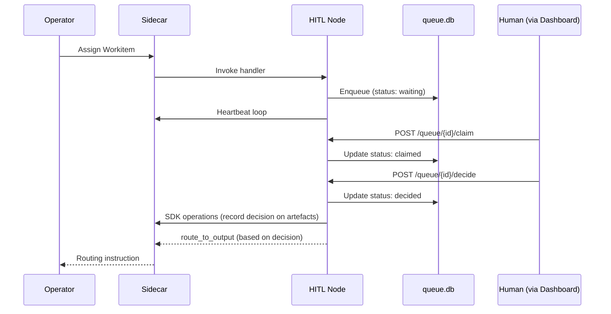
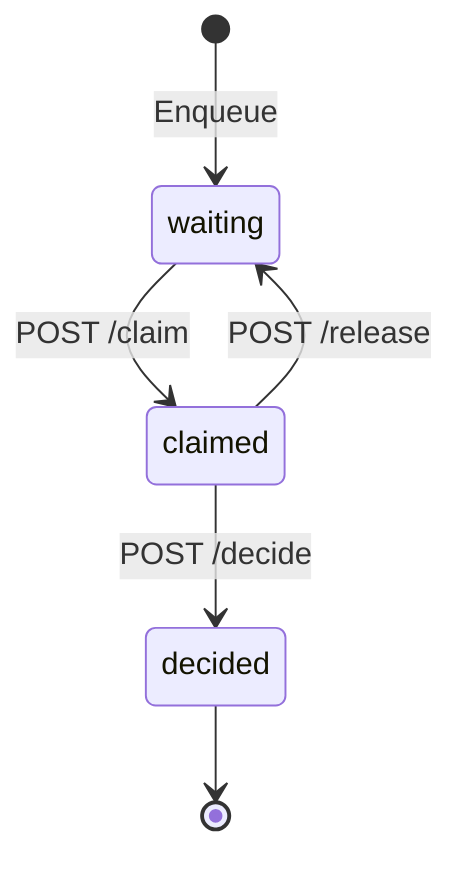
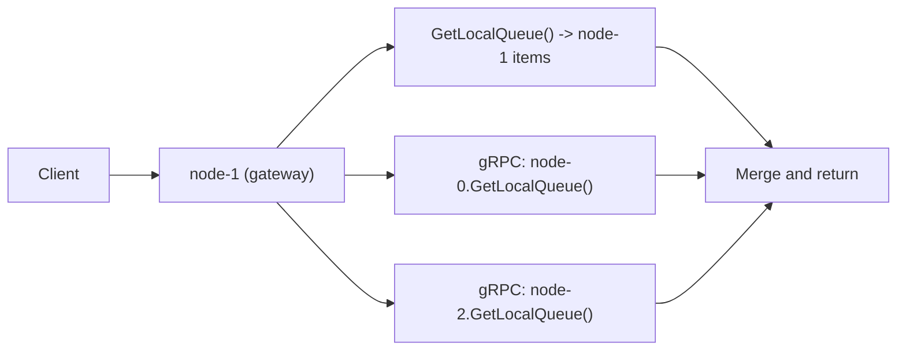

# SDK HITL

The HITL (Human-in-the-Loop) SDK surface provides managed infrastructure for nodes that require human decisions during Workitem processing. Any node can become an HITL node by declaring the `QUEUE:server` [capability](../03-node/02-configuration.md#capability-grants) and configuring persistent storage. The SDK provides queue management, REST API exposure, persistence, and the Federated Queue Mesh for horizontal scaling.

The Judiciary's [Advocate](../02-flow/03-nodes-external.md#the-judiciary--standard-subsystem) is a concrete HITL node for judicial escalation. User-defined HITL nodes compose the same SDK pattern with domain-specific decision logic.

## HITL Runtime Role

An HITL node parks a Workitem in a persistent queue while awaiting a human decision. The Workitem remains assigned to the HITL node — it holds assignment ownership and maintains [heartbeat](../03-node/01-sidecar.md#heartbeat-and-activity-tracking) signals to prevent inactivity timeout. When a human provides a decision through the REST API, the node records the decision on governed artefacts through [SDK operations](./02-sdk-artefacts.md), then returns a routing instruction based on the decision.



## `QUEUE:server` Capability

The `QUEUE:server` capability enables HITL features on a node. When declared, the [Operator](../02-flow/01-operator.md) applies specific provisioning:

| Operator action | Description |
|---|---|
| **StatefulSet deployment** | Deploys the node as a StatefulSet (not ReplicaSet), providing stable pod identity for DNS-based peer discovery. |
| **Headless Service** | Creates a Headless Service (no ClusterIP) for the node, enabling pod-level DNS resolution. |
| **Storage validation** | Rejects nodes declaring `QUEUE:server` without `spec.storage`. Persistent storage is required for queue durability. |

The Operator validates at admission time:

| Condition | Result |
|---|---|
| `QUEUE:server` without `spec.storage` | Rejected — `SCHEMA_VALIDATION_FAILED` |
| `QUEUE:server` with `spec.storage` | StatefulSet deployment, Headless Service created |

## QueueManager Interface

The SDK provides a `QueueManager` interface for nodes using `QUEUE:server`. The QueueManager handles local persistence, peer communication, and proxy routing transparently.

```go
type QueueManager interface {
    // Enqueue adds an item to the local shard's queue.
    Enqueue(ctx context.Context, workitemID string, payload interface{}) (string, error)

    // GetGlobalQueue returns items from all shards via scatter-gather.
    GetGlobalQueue(ctx context.Context, filter QueueFilter) ([]QueueItem, error)

    // GetLocalQueue returns items from this shard only.
    GetLocalQueue(ctx context.Context, filter QueueFilter) ([]QueueItem, error)

    // Claim marks an item as claimed. Proxied to the owning shard if remote.
    Claim(ctx context.Context, itemID string) (*QueueItem, error)

    // Release unclaims an item. Proxied to the owning shard if remote.
    Release(ctx context.Context, itemID string) (*QueueItem, error)

    // Complete marks an item as decided with a result. Proxied to the owning shard if remote.
    Complete(ctx context.Context, itemID string, result interface{}) error

    // GetPeers returns currently connected peer shard IDs.
    GetPeers(ctx context.Context) ([]string, error)
}
```

The QueueManager is available to the node handler when the `QUEUE:server` capability is declared. All queue operations are node-local — the [Sidecar](../03-node/01-sidecar.md) does not mediate the QueueManager or the human-facing REST API. The Sidecar mediates the SDK calls the node makes after receiving human input (artefact writes, feedback transitions, routing instructions).

## REST API Contract

HITL nodes expose a standard HTTP API for external tooling (dashboards, CLIs, mobile applications). The API is node-owned — the Sidecar does not mediate human-facing traffic.

### Endpoints

| Method | Path | Description |
|---|---|---|
| `GET` | `/queue` | List items in the queue. Supports `status` filter (`waiting`, `claimed`), `limit`, and `offset` for pagination. Scatter-gather across all mesh peers. |
| `GET` | `/queue/{id}` | Get full detail for a specific queue item by Workitem ID. |
| `POST` | `/queue/{id}/claim` | Claim an item for review. Transitions `waiting` to `claimed`. Returns `409 Conflict` if already claimed. |
| `POST` | `/queue/{id}/decide` | Submit a decision. Transitions `claimed` to `decided`. The request body is domain-specific (output channel name, decision payload). |
| `POST` | `/queue/{id}/release` | Release a claimed item back to `waiting`. |

### State Engine Model

The HITL node is a mechanical queue that tracks status transitions. Human identity, assignment mapping, and audit trail correlation are the Dashboard/BFF's responsibility.



| State | Description |
|---|---|
| `waiting` | Item is in the queue, available for claim. |
| `claimed` | Item is locked for review. The Dashboard tracks who claimed it. |
| `decided` | Human decision has been submitted. The handler unblocks and routes. |

The separation of concerns is strict:

| Concern | Owner |
|---|---|
| Queue state (`waiting`, `claimed`, `decided`) | HITL Node (QueueManager, SQLite) |
| Human identity (who claimed, who decided) | Dashboard/BFF (external IdP) |
| Assignment mapping (which human has which item) | Dashboard/BFF (its own database) |
| Audit trail with identity correlation | Dashboard/BFF |

## Persistence

The SDK manages a SQLite database at `{storage.mountPath}/queue.db`. The schema is SDK-owned and automatically initialised on first startup.

### Schema

```sql
CREATE TABLE hitl_queue (
    id TEXT PRIMARY KEY,
    shard_id TEXT NOT NULL,
    workitem_id TEXT NOT NULL,
    payload_json TEXT NOT NULL,
    status TEXT DEFAULT 'waiting',
    enqueued_at TIMESTAMP DEFAULT CURRENT_TIMESTAMP,
    claimed_at TIMESTAMP,
    decided_at TIMESTAMP,
    decision_json TEXT
);

CREATE INDEX idx_status ON hitl_queue(status);
CREATE INDEX idx_shard ON hitl_queue(shard_id);
CREATE INDEX idx_workitem ON hitl_queue(workitem_id);
```

The `shard_id` is the pod's stable identity from the StatefulSet (e.g., `review-queue-0`). REST API clients operate on Workitem IDs — shard identity is a transport-layer detail handled by the QueueManager.

## Federated Queue Mesh

When an HITL node scales to multiple replicas, each pod maintains its own `queue.db` with isolated storage (shared-nothing architecture). The Federated Queue Mesh provides a unified "Global Queue" view across all replicas through peer-to-peer gRPC communication.

### Peer Discovery

Nodes discover peers via the Headless Service's DNS records:

```text
DNS Query: review-queue.flow-ns.svc.cluster.local
Returns:   review-queue-0.review-queue.flow-ns.svc.cluster.local
           review-queue-1.review-queue.flow-ns.svc.cluster.local
           review-queue-2.review-queue.flow-ns.svc.cluster.local
```

The QueueManager:

1. Queries DNS on startup and periodically (every 30 seconds).
2. Maintains gRPC connections to all discovered peers.
3. Handles peer join and leave gracefully.

### Read Pattern: Scatter-Gather

A read request to any pod triggers parallel `GetLocalQueue` calls to all peers:



The response includes shard ownership metadata for each item. Clients do not need to know shard identity for read operations — the mesh handles routing transparently.

### Write Pattern: Proxy Routing

Mutations (claim, release, decide) are proxied to the owning shard:

| Request target | Owner shard | Action |
|---|---|---|
| `node-1` | `node-1` | Execute locally |
| `node-1` | `node-0` | Proxy to `node-0` via gRPC |
| `node-1` | `node-2` (down) | Return `503 Service Unavailable` |

Each queue item has exactly one owner shard. Consistent ownership means writes always go to the same pod for a given item, maintaining isolation.

### Partial Availability

If a pod is down, the mesh operates in degraded mode:

| Scenario | Behaviour |
|---|---|
| Pod down | Items on that pod are invisible in reads; other pods continue serving. |
| Write to down shard | `503 Service Unavailable` with shard identity in response. |
| Pod recovery | Pod restarts, rejoins the mesh, items become visible again. |

Partial availability is preferred over total outage. Work continues on healthy shards while unhealthy shards recover.

### Failure Detection

| Mechanism | Configuration |
|---|---|
| Peer health | gRPC keepalive (10-second interval, 20-second timeout) |
| Query timeout | Scatter-gather uses 5-second timeout per peer; slow peers are excluded |
| Write failure | No automatic retry to down shards (fail fast, let client retry) |

### QueuePeer gRPC Service

The mesh uses a `QueuePeer` gRPC service for inter-pod communication:

| Method | Description |
|---|---|
| `GetLocalQueue` | Returns items from the local shard's `queue.db`. |
| `ClaimItem` | Claims an item on the local shard. |
| `ReleaseItem` | Releases a claimed item on the local shard. |
| `CompleteItem` | Marks an item as decided on the local shard. |

Telemetry events for peer lifecycle:

| Event | When |
|---|---|
| `foundry.hitl.peer_joined` | New peer discovered via DNS |
| `foundry.hitl.peer_left` | Peer connection lost |

## Security Model

### Network Exposure

The HITL REST API is an internal service. It is:

- Exposed on the pod's service port.
- **Not** exposed via external Ingress.
- Protected by Kubernetes NetworkPolicies that restrict access to authorised consumers (Dashboard/BFF pods).

### Authentication

The HITL node performs no authentication. It trusts the internal network. Authentication and authorisation are the responsibility of the edge service (Dashboard/BFF) that calls the REST API. The Dashboard authenticates the human user through its own identity provider (OAuth, SAML, SSO) before forwarding requests to the HITL node.

### Sidecar Boundary

The Sidecar does not mediate the human-facing REST API. The Sidecar mediates the SDK calls the node makes after receiving human input — artefact writes, feedback transitions, routing instructions. This is consistent with the principle that the Sidecar mediates platform operations, not external interfaces.

## Escalation Patterns

HITL escalation is built on routing topology — it uses the same `timeout` output mechanism as any other node. No special escalation infrastructure exists.

### Timeout Escalation Chain

Each HITL node in an escalation chain has a `timeout` output pointing to the next level:

```text
manager-review (timeout: 2h)
  ├── timeout -> director-review
  ├── approved -> next-stage
  └── rejected -> ...

director-review (timeout: 4h)
  ├── timeout -> vp-review
  ├── approved -> next-stage
  └── rejected -> ...

vp-review (timeout: 8h)
  ├── approved -> next-stage
  └── rejected -> ...
  (no timeout output — terminal escalation)
```

Each escalation resets the deadline to the new node's configured [timeout](../03-node/02-configuration.md#timeout-and-execution-budget). The final node in the chain has no `timeout` output — the Workitem fails on timeout if no decision is made.

### Delegate Pattern

Route to a backup reviewer when the primary is unavailable:

```yaml
# Primary reviewer with delegate fallback
kind: FoundryNode
metadata:
  name: alice-review
spec:
  timeout: "8h"
  outputs:
    - name: "approved"
      target: "next-stage"
    - name: "timeout"
      target: "bob-review"
```

### Pool Escalation

Escalate from an individual reviewer to a pool of available reviewers:

```yaml
kind: FoundryNode
metadata:
  name: assigned-reviewer
spec:
  timeout: "4h"
  outputs:
    - name: "approved"
      target: "next-stage"
    - name: "timeout"
      target: "reviewer-pool"
```

## Telemetry

HITL nodes emit telemetry events through [`RecordTelemetry()`](./06-sdk-telemetry.md) via the Sidecar:

| Event | When | Payload |
|---|---|---|
| `foundry.hitl.enqueued` | Workitem enters queue | `workitemId`, `nodeId`, `queueDepth` |
| `foundry.hitl.claimed` | Item claimed | `workitemId`, `waitTime` |
| `foundry.hitl.released` | Item unclaimed | `workitemId`, `claimDuration` |
| `foundry.hitl.decided` | Decision submitted | `workitemId`, `output`, `decisionTime` |
| `foundry.hitl.escalated` | Timeout triggered escalation | `workitemId`, `fromNode`, `toNode`, `waitTime` |
| `foundry.hitl.timeout_failed` | Timeout with no escalation route | `workitemId`, `nodeId`, `waitTime` |
| `foundry.hitl.peer_joined` | New mesh peer discovered | `peerId`, `peerCount` |
| `foundry.hitl.peer_left` | Mesh peer connection lost | `peerId`, `peerCount`, `reason` |

Telemetry tracks status transitions. The consuming layer (Dashboard/BFF) correlates decisions with human identity.

### Friction

HITL escalation emits friction at magnitude `depth ^ (rounds * 2)`, where `depth` is the feedback item's history depth and `rounds` is the number of deliberation rounds that preceded escalation. This makes human intervention the most expensive governance signal, creating a natural pressure to resolve disputes through automated deliberation before reaching human review.

## Advocate: Judiciary HITL Node

The [Advocate](../02-flow/03-nodes-external.md#the-judiciary--standard-subsystem) is the Judiciary's concrete HITL node. It is a standard HITL node using the SDK pattern described in this document, with domain-specific logic for judicial escalation:

- Receives Workitems from the [Arbiter](../02-flow/03-nodes-external.md#the-judiciary--standard-subsystem) (hung jury on deadlock adjudication) and the [Tribunal](../02-flow/03-nodes-external.md#the-judiciary--standard-subsystem) (Tier 3+ escalation from review hearings).
- Parks Workitems in the HITL queue for human decision.
- The human reviewer (via Dashboard/BFF) reviews the judicial context and renders a decision.
- The Advocate records the decision on artefacts and routes based on the human verdict.

For Tier 3 proposals, the human ratifies or rejects the proposed law change. For Tier 4-5 appeals, the Advocate routes to the [Governance Flow](../01-concepts/04-governance.md#the-governance-flow). The Advocate's routing topology is defined by the Operator at provisioning time.

## HITL SDK Invariants

1. `QUEUE:server` capability requires `spec.storage`. The Operator rejects nodes declaring the capability without storage.
2. `QUEUE:server` triggers StatefulSet deployment and Headless Service creation.
3. The HITL REST API is node-owned. The Sidecar does not mediate human-facing traffic.
4. The Sidecar mediates SDK calls the node makes after receiving human input.
5. The HITL node is a state engine — it tracks queue status transitions. Human identity and assignment mapping are Dashboard/BFF responsibilities.
6. Persistence uses SDK-managed SQLite at `{storage.mountPath}/queue.db`.
7. The Federated Queue Mesh provides scatter-gather reads and proxy writes across scaled replicas with no centralised database.
8. Partial mesh availability is preferred over total outage.
9. Escalation chains use standard `timeout` outputs — no special escalation infrastructure.
10. Telemetry events are emitted for all queue state transitions and mesh peer lifecycle changes.
