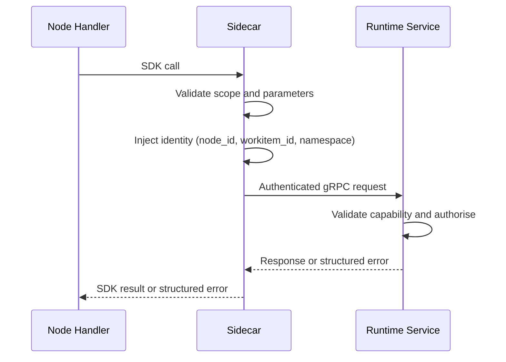

# gRPC API Reference

All runtime services expose gRPC APIs. Node-originated calls are mediated by the [Sidecar](../03-node/01-sidecar.md), which authenticates, injects identity context, and proxies to the owning service. Inter-service calls use direct service-to-service gRPC.

## Service Inventory

| Service | Responsibility | Primary Consumers |
|---------|---------------|-------------------|
| [Operator](#operator-api) | Workitem lifecycle, routing, assignment, entry/exit contract enforcement | Sidecar (on behalf of nodes) |
| [Archivist](#archivist-api) | Artefact content, versions, stamps, feedback | Sidecar (on behalf of nodes), Operator |
| [Librarian](#librarian-api) | Law storage, retrieval, integration | Sidecar (on behalf of nodes), Operator |
| [Flow Monitor](#flow-monitor-api) | Pipeline adapter for metrics export (Prometheus) and audit log emission (stdout) | Subscribes to Flow Event Bus |
| [Flow Event Bus](#flow-event-bus-api) | Durable event distribution across telemetry, audit, friction, and workitem channels | Sidecar (publish), all services (publish/subscribe) |
| [Friction Ledger](#friction-ledger-api) | Friction aggregation, threshold evaluation, friction queries | Sidecar (on behalf of nodes), Librarian, Friction Ledger publishes to Bus |
| [Sidecar](#sidecar-mediated-sdk-paths) | Authentication proxy, identity injection, local validation | Node handlers (via SDK) |
| [Embassy](#embassy-api) | Cross-flow Workitem transfer: manifest preflight, package streaming, naturalisation | Operator, Sidecar (on behalf of nodes), remote Embassies |
| [Federation](#federation-api) | Federation membership, law publication, conflict rejection, distribution | Embassy, Librarian, authority publishers |
| [Support Services](#support-service-api) | Pluggable capabilities (e.g. codification) | Sidecar (on behalf of nodes), system services |
| [QueuePeer](#queuepeer-api) | Federated Queue Mesh inter-pod communication | HITL node replicas (peer-to-peer) |

---

## Operator API

The Operator API handles Workitem control-plane mutations. All node-facing methods are reached through the Sidecar; the Operator also exposes internal methods for service-to-service coordination.

### Node-Facing Methods (via Sidecar)

| Method | Request | Response | Description |
|--------|---------|----------|-------------|
| `SubmitResult` | `workitem_id`, `routing_instruction` | `accepted` or structured error | Submits the handler's routing instruction. The Operator validates routing guards and applies the lifecycle transition. |
| `CreateWorkitem` | (none) | `workitem_id` or structured error | Creates a new Workitem in `Pending`. The creating node must be entry-bound. The Operator validates the bound entry contract against artefact state in the Archivist. |
| `CreateChildWorkitem` | (none) | `child_workitem_id` or structured error | Creates a child Workitem in `Pending` with `parentWorkitemID` set to the caller's current Workitem. The Operator applies the `flow.gideas.io/parent` label. Requires `CREATE:workitem/child` capability. Identity comes from Sidecar-injected metadata — the request body is empty. |
| `RouteChild` | `child_workitem_id`, `routing_instruction` | `accepted` or structured error | Submits a routing instruction for a child Workitem. The Operator validates that the child's `parentWorkitemID` matches the caller's current Workitem, that the child is in `Pending` state (not yet routed), and that the routing target exists. If the creating node has `childWorkitems.entryContract` configured, the Operator validates the child's artefact state against that contract before routing. |
| `GetChildren` | (none) | `repeated ChildWorkitemStatus` | Returns the current state of all child Workitems for the caller's parent Workitem. The Operator queries by `flow.gideas.io/parent` label and includes artefact references from the Archivist. Identity comes from Sidecar-injected metadata — the request body is empty. |
| `GetFlowTopology` | (none) | `self`, `nodes`, `exit_contract` | Returns the Flow topology visible to the calling node. Requires `READ:flow` capability. The Sidecar injects node identity; the Operator resolves the calling node's outputs, all peer nodes with capabilities, and the bound exit contract (if exit-bound). Identity comes from Sidecar-injected metadata — the request body is empty. |

### Service-Facing Methods

| Method | Request | Response | Description |
|--------|---------|----------|-------------|
| `NotifyExportReady` | `workitem_id` | `acknowledged` | Signals the Operator that a Workitem has completed its exit contract and is eligible for cross-flow export via the Embassy. The Operator marks the Workitem as export-ready. |

### Routing Instruction Shape

| Field | Type | Description |
|-------|------|-------------|
| `type` | `string` | `route_to_output`, `route_to`, or `complete`. |
| `target` | `string` | Output name (for `route_to_output`), node name (for `route_to`), or empty (for `complete`). |

### ChildWorkitemStatus Shape

| Field | Type | Description |
|-------|------|-------------|
| `workitem_id` | `string` | Child Workitem identifier. |
| `phase` | `string` | Current lifecycle state: `Pending`, `Running`, `Completed`, `Failed`. |
| `current_assignee` | `string` | Node currently assigned to the child. Empty when `Pending`. |
| `artefacts` | `repeated ArtefactRef` | Artefact references (`id`, `governed_artefact`) associated with the child in the Archivist. |

### Validation and Error Responses

| Condition | Error | gRPC Status |
|-----------|-------|-------------|
| Output name not in node's configured outputs | `INVALID_ROUTE` | `FAILED_PRECONDITION` |
| Target node does not exist as a FoundryNode | `INVALID_ROUTE` | `FAILED_PRECONDITION` |
| `complete` from non-exit node | `EXIT_NOT_BOUND` | `FAILED_PRECONDITION` |
| Exit contract not satisfied | `CONTRACT_VIOLATION` | `FAILED_PRECONDITION` |
| Thrash budget exceeded | `THRASH_BUDGET_EXCEEDED` | `FAILED_PRECONDITION` |
| Entry contract not satisfied (CreateWorkitem) | `CONTRACT_VIOLATION` | `FAILED_PRECONDITION` |
| Creating node not entry-bound | `ENTRY_NOT_BOUND` | `FAILED_PRECONDITION` |
| Imported Workitem does not satisfy import type node's entry contract | `IMPORT_ADMISSION_FAILED` | `FAILED_PRECONDITION` |
| Parent `Complete()` with non-terminal children | `CHILDREN_NOT_TERMINAL` | `FAILED_PRECONDITION` |
| Child Workitem not owned by caller's current Workitem | `CHILD_NOT_OWNED` | `FAILED_PRECONDITION` |
| Write or re-route on a child that has already been routed | `CHILD_ALREADY_ROUTED` | `FAILED_PRECONDITION` |
| Missing `CREATE:workitem/child` capability | `CAPABILITY_DENIED` | `PERMISSION_DENIED` |
| Routing from outside a group to a non-entry-bound node inside the group | `GROUP_ROUTING_DENIED` | `FAILED_PRECONDITION` |
| Root Workitem routed to group entry node without satisfying group entry contract | `GROUP_ENTRY_VIOLATION` | `FAILED_PRECONDITION` |

---

## Archivist API

The Archivist API manages artefact lifecycle and provenance. All node-facing methods are reached through the Sidecar. The Operator also exposes service-facing methods for contract validation.

### Service-Facing Methods

| Method | Request | Response | Description |
|--------|---------|----------|-------------|
| `QueryArtefactState` | `workitem_id`, `governed_artefacts[]` | `artefact_states[]` | Returns artefact presence and stamp state for exit contract validation. Called by the Operator's own reconciliation loop. |

### Artefact Content and Version Methods

| Method | Request | Response | Description |
|--------|---------|----------|-------------|
| `GetArtefact` | `workitem_id`, `artefact_id`, `target_workitem_id?` | `content`, `version_hash`, `governed_artefact` | Returns the latest version's content bytes. Sidecar verifies `SHA256(content) == version_hash`. When `target_workitem_id` is set, reads from a child Workitem — the Archivist validates that the caller's Workitem is the parent of the target and that the target is in `Completed` state. |
| `GetArtefactVersion` | `workitem_id`, `artefact_id`, `version_hash` | `content` | Returns content bytes for a specific version by hash. |
| `GetArtefactMetadata` | `workitem_id`, `artefact_id` | `version_history[]`, `stamps[]` | Returns version history and current passport without content bytes. |
| `ListArtefacts` | `workitem_id`, `target_workitem_id?` | `artefact_refs[]` | Returns all artefacts (`id`, `governed_artefact`) associated with the Workitem. The Archivist is the source of truth for artefact-to-Workitem relationships. When `target_workitem_id` is set, lists artefacts from a child Workitem — same parent-child and completion validation as `GetArtefact`. |
| `StoreArtefact` | `workitem_id`, `artefact_id`, `governed_artefact`, `content`, `content_hash`\* | `version_hash`, `is_new_version` | Stores content bytes and creates a version record. Returns the confirmed version hash and whether a new version was created. \*`content_hash` is Sidecar-computed, not node-supplied. |

### Stamp Methods

| Method | Request | Response | Description |
|--------|---------|----------|-------------|
| `GetStamps` | `workitem_id`, `artefact_id` | `stamps[]` | Returns all stamps on the artefact's current version. Each stamp includes name, applying node, content hash, signature, and certificate chain. |
| `HasStamp` | `workitem_id`, `artefact_id`, `stamp_name` | `exists` (bool) | Returns whether the named stamp exists on the current version. |
| `StampArtefact` | `workitem_id`, `artefact_id`, `stamp_name`, `signature`\*, `cert_chain`\* | `stamp_record` | Applies a named stamp. \*`signature` and `cert_chain` are Sidecar-injected from the node's identity material. The Archivist validates: (1) `STAMP:artefact/<name>/<stamp-name>` capability, (2) stamp has not already been applied to this version (write-once). |

### Feedback Methods

| Method | Request | Response | Description |
|--------|---------|----------|-------------|
| `AddFeedback` | `workitem_id`, `artefact_id`, `severity`, `message`, `version_hash`\* | `feedback_id` | Creates a feedback item in `new` state, tagged to the artefact's current version. \*`version_hash` is Sidecar-resolved from the latest version at call time. Transparently emits `AddFriction` with magnitude = feedback depth. |
| `GetFeedback` | `workitem_id`, `artefact_id` | `feedback_items[]` | Returns all feedback items for the artefact across all versions. |
| `HasUnresolvedFeedback` | `workitem_id`, `artefact_id` | `has_unresolved` (bool) | Returns `true` if any feedback item is in a non-`resolved` state. |
| `ResolveFeedback` | `workitem_id`, `feedback_id`, `message` | `updated_item` | Transitions feedback from `new` or `rejected` to `actioned`. |
| `RefuseFeedback` | `workitem_id`, `feedback_id`, `justification` | `updated_item` | Transitions feedback from `new` or `rejected` to `wont_fix`. Requires structured justification (`citation` with `citation_ids[]` or `novel_argument` with `argument`). |
| `AcceptFix` | `workitem_id`, `feedback_id` | `updated_item` | Transitions feedback from `actioned` to `resolved`. |
| `RejectFix` | `workitem_id`, `feedback_id`, `message` | `updated_item` | Transitions feedback from `actioned` to `rejected`. |
| `AcceptRefusal` | `workitem_id`, `feedback_id` | `updated_item` | Transitions feedback from `wont_fix` to `resolved`. |
| `RejectRefusal` | `workitem_id`, `feedback_id`, `message` | `updated_item` | Transitions feedback from `wont_fix` to `rejected`. |
| `GetFeedbackDepth` | `workitem_id`, `feedback_id` | `depth` (integer) | Returns the current history depth (number of transitions) for the specified feedback item. |
| `DeadlockFeedback` | `workitem_id`, `feedback_id` | `updated_item` | Transitions feedback from any non-resolved, non-deadlocked state to `deadlocked`. Requires `WRITE:feedback/deadlocked` capability. The Archivist validates capability, from-state, and contempt guard (items with `linkedRuling` cannot be deadlocked); deadlock determination is gate node logic, not Archivist enforcement. |
| `LinkRuling` | `workitem_id`, `feedback_id`, `law_id`, `target_state` | `updated_item` | Links a judiciary ruling to a deadlocked feedback item, atomically setting `linked_ruling` and transitioning the feedback to `target_state` (`wont_fix` or `rejected`). Requires `WRITE:feedback/link-ruling` capability. Enforces contempt guard: feedback must be in `deadlocked` state and must not already have a linked ruling. Records a `link_ruling` feedback event for audit trail continuity. |

### Archivist Error Responses

| Condition | Error | gRPC Status |
|-----------|-------|-------------|
| Missing `READ:artefact` capability | `CAPABILITY_DENIED` | `PERMISSION_DENIED` |
| Missing `WRITE:artefact` capability | `CAPABILITY_DENIED` | `PERMISSION_DENIED` |
| Missing `STAMP:artefact/<name>/<stamp>` capability | `CAPABILITY_DENIED` | `PERMISSION_DENIED` |
| Missing `READ:feedback` or `WRITE:feedback/<status>` capability | `CAPABILITY_DENIED` | `PERMISSION_DENIED` |
| Stamp already applied to this version | `STAMP_ALREADY_APPLIED` | `ALREADY_EXISTS` |
| Content hash mismatch on read | `ARTEFACT_CORRUPTED` | `DATA_LOSS` |
| Existing `id` with different `governed_artefact` | `ARTEFACT_KIND_CONFLICT` | `INVALID_ARGUMENT` |
| `governed_artefact` name not registered as a GovernedArtefact CRD | `UNKNOWN_GOVERNED_ARTEFACT` | `FAILED_PRECONDITION` |
| Invalid feedback state transition | `INVALID_STATE_TRANSITION` | `FAILED_PRECONDITION` |
| Attempt to override a judicially-linked ruling | `CONTEMPT_VIOLATION` | `FAILED_PRECONDITION` |
| Feedback ID not found | `FEEDBACK_NOT_FOUND` | `NOT_FOUND` |
| Message exceeds 1024 characters | `MESSAGE_TOO_LONG` | `INVALID_ARGUMENT` |

---

## Librarian API

The Librarian API manages the Flow's body of law. Node-facing methods are reached through the Sidecar. The Librarian also exposes service-facing methods for law application, dispute-record tracking, and federation publication distribution.

### Node-Facing Methods (via Sidecar)

| Method | Request | Response | Description |
|--------|---------|----------|-------------|
| `QueryLaws` | `filter` (optional) | `laws[]` | Returns laws matching the filter. Three modes: (1) no filter — all laws, (2) `governed_artefact` — laws whose `appliesTo` includes the governed artefact plus global laws, (3) `governed_artefact` + `representation_type` — same governed artefact filter plus at least one representation of the requested MIME type. All modes return full law objects. |
| `RecordFinding` | `goal`, `applies_to[]`, `representations[]` | `law_id` | Creates a Tier 1 Finding. Write-availability-first: returns immediately with a law identifier. Indexing and duplicate detection are asynchronous. |

### Service-Facing Methods

| Method | Request | Response | Description |
|--------|---------|----------|-------------|
| `GetLaw` | `law_id` | `law` | Returns the full law object by identifier. Used by Judiciary nodes for hearing evidence retrieval. |
| `WriteLaw` | `law` | `law_id`, `version_hash` | Persists a law written by the [law-applicator](../01-concepts/02-foundry-cycle.md#law-applicator) or by administrator action. If the source petition carried a `petition_id`, that provenance is stored on the written law. |
| `RetireLaw` | `law_id` | `acknowledged` | Removes a law from the active Library. History is preserved in the audit log. |
| `CreateDisputeRecord` | `petition_id`, `cited_law_ids[]` | `dispute_record_id` | Creates a dispute record for an approved T4-5 petition before Embassy export. |
| `RetireDisputeRecord` | `petition_id` | `acknowledged` | Retires the active dispute record for the specified petition. Used when the petition outcome is known. |
| `QueryDisputeRecords` | `petition_id?`, `law_id?`, `status?` | `records[]` | Returns dispute records by petition, cited law, or status. Used by Sort and petition-outcome-watcher flows. |
| `IntegratePublishedLaw` | `law`, `source_flow_identity`, `publication_scope` | `integration_result` | Receives a published law from the Federation service for local integration. Triggers the two-stage conflict protocol. |

### Librarian Error Responses

| Condition | Error | gRPC Status |
|-----------|-------|-------------|
| Missing `READ:law` capability | `CAPABILITY_DENIED` | `PERMISSION_DENIED` |
| Missing `WRITE:law/tier1` capability | `CAPABILITY_DENIED` | `PERMISSION_DENIED` |
| Cited law does not exist or is retired | `LAW_NOT_FOUND` | `NOT_FOUND` |
| Finding goal exceeds maximum length | `MESSAGE_TOO_LONG` | `INVALID_ARGUMENT` |
| Librarian service unavailable | `SERVICE_UNAVAILABLE` | `UNAVAILABLE` |
| Certificate chain invalid on replicated laws | `TRUST_CHAIN_INVALID` | `PERMISSION_DENIED` |
| No Treaty configured for the required direction | `TREATY_NOT_FOUND` | `NOT_FOUND` |

---

## Flow Monitor API

The Flow Monitor exposes no gRPC service definition and accepts no direct gRPC calls. It is an internal subscriber of the Flow Event Bus (telemetry and audit channels) and exposes only an HTTP `/metrics` endpoint for Prometheus scraping and JSON Lines on stdout for audit log pipelines.

The Flow Monitor is a stateless pipeline adapter. It does not persist events, serve query APIs, or accept direct ingestion calls. It may persist a lightweight replay checkpoint (last-seen sequence number per channel) to avoid delivery gaps across restarts; this is not an event store. Event buffering and delivery guarantees are Flow Event Bus concerns.

### Flow Monitor Error Responses

| Condition | Error | gRPC Status |
|-----------|-------|-------------|
| Flow Monitor unavailable | `SERVICE_UNAVAILABLE` | `UNAVAILABLE` |

---

## Flow Event Bus API

The Flow Event Bus is a channel-agnostic, shape-agnostic event distribution service. Channels
are free-form strings — adding a new channel or filter dimension requires no code changes, proto
regeneration, or rebuilds. All events are persisted to a SQLite append-only log before fan-out.

### Publish Methods

| Method | Request | Response | Description |
|--------|---------|----------|-------------|
| `Publish` | `channel` (string), `event` | `acknowledged`, `sequence` | Publishes an event to the specified channel (e.g. `"telemetry"`, `"audit"`, `"friction"`, `"workitem"`). Write-ahead — the producer receives acknowledgement with the assigned sequence number after the event is persisted to the log. |

### Subscribe Methods

| Method | Request | Response | Description |
|--------|---------|----------|-------------|
| `Subscribe` | `channel` (string), `filter`, `last_sequence?` | `stream FlowEvent` | Opens a server-side stream of events matching the channel and optional filter. If `last_sequence` is provided, the Bus replays events from that sequence number (if still within the retention window) before switching to live delivery. The stream remains open until the client disconnects. |

### Label Shape

Labels are repeated key-value pairs for server-side filtering. Using a repeated message (not a map) allows multiple values for the same key (e.g. `law_id=law-1` and `law_id=law-2` on the same event).

| Field | Type | Description |
|-------|------|-------------|
| `key` | `string` | Label key (e.g. `law_id`, `parent_workitem_id`, `phase`, `workitem_id`, `node_id`). |
| `value` | `string` | Label value. |

### Event Shape

| Field | Type | Description |
|-------|------|-------------|
| `event_id` | `string` | Unique event identifier. |
| `sequence` | `uint64` | Monotonically increasing sequence number within the channel. Used for replay positioning. |
| `channel` | `string` | Channel name (e.g. `"telemetry"`, `"audit"`, `"friction"`, `"workitem"`). Free-form string; the Bus is channel-agnostic. |
| `event_type` | `string` | Event type identifier (e.g. `friction`, `foundry.cost.llm`, `audit.artefact.stamped`, `friction.threshold_crossed`, `workitem.phase_changed`). |
| `flow_namespace` | `string` | Kubernetes namespace that owns this flow. |
| `node_id` | `string` | Emitting node (empty for service-originated events). |
| `workitem_id` | `string` | Associated Workitem (empty for law-lifecycle audit events). |
| `timestamp` | `Timestamp` | Event timestamp. |
| `trace_id` | `string` | Distributed trace context identifier. Injected by the Sidecar from the active trace. Empty if tracing is not configured. |
| `attributes` | `map<string, string>` | Arbitrary key-value metadata not used for server-side filtering. For friction events: `magnitude`. For audit events: `action`, `resource_id`. For threshold-crossing events: `tier`, `accumulated_friction`, `threshold`. For workitem lifecycle events: `namespace`. |
| `payload` | `bytes` | Optional structured payload (max 64 KB). |
| `labels` | `repeated Label` | Repeated labels for server-side filtering. For friction events: `law_id` (repeated per attributed law). For workitem lifecycle events: `workitem_id`, `phase`, `node_id`, `parent_workitem_id` (if child). For threshold-crossing events: `law_id`. |

### Subscribe Filter

| Field | Type | Description |
|-------|------|-------------|
| `event_type` | `string` | Optional: filter to specific event type. Convenience field — every subscriber uses it. |
| `match_labels` | `repeated Label` | Optional: AND-match filter. Every label in the filter must have at least one matching label on the event. For example, `[{parent_workitem_id, "wi-42"}]` matches events with a `parent_workitem_id=wi-42` label. |

### Flow Event Bus Error Responses

| Condition | Error | gRPC Status |
|-----------|-------|-------------|
| Flow Event Bus unavailable | `SERVICE_UNAVAILABLE` | `UNAVAILABLE` |
| Requested sequence number is beyond retention window | `SEQUENCE_EXPIRED` | `OUT_OF_RANGE` |

---

## Friction Ledger API

The Friction Ledger aggregates friction events and serves friction queries. Node-facing methods
are reached through the Sidecar. The Librarian and other services use direct service-to-service
gRPC.

### Query Methods

| Method | Request | Response | Description |
|--------|---------|----------|-------------|
| `QueryFriction` | `filter` (by `law_id`, `node_id`, `workitem_id`, `tier`, `time_range`) | `friction_aggregates[]` | Returns aggregated friction data across the requested axes. Used by the Tribunal for hearing evidence and by the Librarian for catch-up on startup/reconnection. |

### Friction Ledger Error Responses

| Condition | Error | gRPC Status |
|-----------|-------|-------------|
| Friction Ledger unavailable | `SERVICE_UNAVAILABLE` | `UNAVAILABLE` |

---

## Sidecar-Mediated SDK Paths

The [Sidecar](../03-node/01-sidecar.md) abstracts all transport — the node sees SDK calls, and the Sidecar authenticates, injects identity, and proxies to the owning service:

### Identity Injection

Every outgoing request from the Sidecar carries:

| Field | Source | Description |
|-------|--------|-------------|
| `node_id` | Sidecar identity material | The node's identity. |
| `workitem_id` | Current assignment | The Workitem being processed. Empty for entry-bound calls before a Workitem is created. |
| `namespace` | Sidecar environment (`FLOW_NAMESPACE`) | The Kubernetes namespace (flow identity) this node belongs to. Carried on the wire as the `x-flow-namespace` gRPC metadata header. |

Nodes cannot override or spoof these fields. The Sidecar is the sole authority for runtime attribution on node-originated requests.

### Authorisation Split

| Layer | Responsibility |
|-------|---------------|
| Sidecar | Scope validation (assignment boundaries), parameter validation (malformed requests), authentication (identity material). |
| Runtime service | Capability enforcement, state machine validation, write-once enforcement, contempt guard. |

The Sidecar catches invalid requests early. The owning service makes authoritative governance decisions.

### Sidecar-Local Operations

| Method | Request | Response | Description |
|--------|---------|----------|-------------|
| `Heartbeat` | `workitem_id` | `acknowledged` | Resets the Sidecar's inactivity timer. Implicit heartbeats occur on every SDK call; this method provides an explicit signal for long-running computation. The Sidecar propagates activity timestamps to the Operator, throttled to avoid excessive writes. |
| `PauseTimer` | `workitem_id` | `acknowledged` | Suspends the Sidecar's inactivity timer for the specified Workitem assignment. The timer remains suspended until `ResumeTimer` is called or the handler returns. Used by [HITL nodes](../04-sdk/08-sdk-hitl.md) to park Workitems while awaiting external input without triggering timeout. The Workitem remains in `Running` state — this is a Sidecar-local mechanism. |
| `ResumeTimer` | `workitem_id` | `acknowledged` | Resumes the Sidecar's inactivity timer after a `PauseTimer` call. The timer resets to the full timeout window on resume. |

### Sidecar-Mediated Telemetry

These methods were previously on `FlowMonitorService`. They now live on `SidecarService` because the Sidecar is the translation boundary that wraps SDK calls into FlowEvent publishes to the Flow Event Bus.

| Method | Request | Response | Description |
|--------|---------|----------|-------------|
| `AddFriction` | `magnitude` (double), `law_ids` (repeated string) | `acknowledged` | Enforces `WRITE:friction` capability. Injects Sidecar-authoritative identity (`namespace`, `workitem_id`, `node_id`). Wraps as a FlowEvent and publishes to the Flow Event Bus friction channel. Non-blocking from the caller's perspective. |
| `RecordTelemetry` | `event_type` (string), `payload` (bytes, max 64 KB) | `acknowledged` | Injects Sidecar-authoritative identity (`namespace`, `workitem_id`, `node_id`). Wraps as a FlowEvent and publishes to the Flow Event Bus telemetry channel. Non-blocking from the caller's perspective. |

### Sidecar Error Responses

| Condition | Error | gRPC Status |
|-----------|-------|-------------|
| Request targets a Workitem outside the current assignment | `ASSIGNMENT_SCOPE_VIOLATION` | `FAILED_PRECONDITION` |
| Identity material expired or invalid | `IDENTITY_EXPIRED` | `UNAUTHENTICATED` |
| Node inactivity timer exceeded | `TIMEOUT_EXCEEDED` | `DEADLINE_EXCEEDED` |
| Missing `WRITE:friction` capability (AddFriction) | `CAPABILITY_DENIED` | `PERMISSION_DENIED` |
| Payload exceeds 64 KB (RecordTelemetry) | `PAYLOAD_TOO_LARGE` | `INVALID_ARGUMENT` |

---

## Judiciary Shared Types

The Judiciary subsystem uses node-based Workitem transitions instead of dedicated gRPC services. Deliberation and codification are externalised into the flow topology — [Juror nodes](../01-concepts/02-foundry-cycle.md#juror-judicial-agent) receive child Workitems, produce verdict artefacts, and call `Complete()`; the Arbiter and Tribunal tally votes internally; the [Clerk cycle](../01-concepts/02-foundry-cycle.md#clerk-cycle) drafts petitions and fans out to [Codification nodes](../01-concepts/02-foundry-cycle.md#codification-nodes). No Jury or Clerk gRPC API exists.

Shared judiciary types are defined in `judiciary.proto`:

| Type | Kind | Description |
|------|------|-------------|
| `ConsensusStrategy` | enum | `SIMPLE_MAJORITY` (>50%), `SUPER_MAJORITY` (>=66%), `UNANIMITY` (100%). Configured on the Arbiter and Tribunal for internal tally. |
| `JurorJustification` | message | Per-Juror verdict record: `juror_id` (opaque), `outcome` (the Juror's vote), `reasoning` (the Juror's justification). Stored as artefacts on child Workitems. |

Detail: [Foundry Cycle](../01-concepts/02-foundry-cycle.md#the-judiciary--standard-subsystem), [Nodes](../02-flow/03-nodes-external.md#the-judiciary--standard-subsystem).

---

## Embassy API

The Embassy is the cross-flow gateway node responsible for Workitem import/export. It replaces the former Operator-centric `ExportWorkitem`/`ImportWorkitem` methods with a manifest-preflight and package-streaming protocol. The Embassy is Operator-provisioned and holds cross-flow transfer capabilities.

### Transfer Methods

| Method | Request | Response | Description |
|--------|---------|----------|-------------|
| `PreflightManifest` | `manifest` (import type, artefact list, stamp summary, source identity, treaty reference) | `accepted` or `rejection_reason` | Validates an inbound transfer request before streaming begins. Checks: import type exists in the receiving Flow's effective import-type registry (built-in system plus flow-authored), treaty permits the import type (if applicable via `allowedImportTypes`), bundle size within limits, source identity validates against trust root (Federation CA for federation-member exchange, Treaty `caCert` for Treaty exchange). Returns rejection reason on failure. |
| `StreamPackage` | `stream PackageChunk` (header + content chunks + trailer with digest) | `import_result` (workitem_id or structured error) | Streams the export package to the receiving Embassy. The header carries the manifest reference from preflight. Content chunks carry artefact bytes, passport stamps, and provenance chain. The trailer carries a package digest. The Embassy verifies `SHA256(chunks) == digest`, applies naturalisation policy, routes the materialised Workitem according to the resolved effective import-type policy, and validates the entry contract. |
| `ExportPackage` | `workitem_id`, `import_type` | `stream PackageChunk` | Assembles and streams an export package from a completed Workitem. Artefact content is scoped by the exit contract. The Embassy signs the package with the Flow's identity material and includes the certificate chain. |

### Embassy Error Responses

| Condition | Error | gRPC Status |
|-----------|-------|-------------|
| Import type not found in the receiving Flow's effective import-type registry | `UNKNOWN_IMPORT_TYPE` | `FAILED_PRECONDITION` |
| Preflight manifest rejected (treaty, size, identity) | `HEADER_REJECTED` | `FAILED_PRECONDITION` |
| Foreign attestation stamps fail chain verification | `FOREIGN_STAMP_INVALID` | `PERMISSION_DENIED` |
| Package content digest does not match trailer | `PACKAGE_DIGEST_MISMATCH` | `DATA_LOSS` |
| Treaty does not permit the requested import type | `TREATY_IMPORT_TYPE_DENIED` | `PERMISSION_DENIED` |
| Naturalisation of imported stamps or artefacts failed | `NATURALISATION_FAILURE` | `FAILED_PRECONDITION` |

---

## Federation API

The Federation service manages membership, law publication, and distribution across Flows that share a common Federation. Authority publishers submit laws for publication admission; the Federation validates role and scope, detects conflicts, and distributes accepted laws to member Flows' Librarians. The Federation also exposes petition-outcome events that the petition-outcome-watcher consumes.

### Membership Methods

| Method | Request | Response | Description |
|--------|---------|----------|-------------|
| `RegisterMember` | `flow_namespace`, `embassy_endpoint`, `federation_ca_cert` | `membership_id`, `state_scope` | Registers a Flow as a member of the Federation. Returns the assigned membership identifier and state scope (the federation-defined group this Flow belongs to). |
| `DeregisterMember` | `membership_id` | `acknowledged` | Removes a Flow from Federation membership. Published laws from this Flow remain in the Federation catalogue until explicitly withdrawn. |
| `ListMembers` | `state_scope?` | `members[]` | Lists Federation members, optionally filtered by state scope. |

### Publication Methods

| Method | Request | Response | Description |
|--------|---------|----------|-------------|
| `SubmitPublication` | `law`, `publisher_identity`, `state_scope` | `publication_id` or structured rejection report | Submits a law for publication admission. The publisher must be an authorised authority publisher for the target state scope. The Federation validates the law, checks for conflicts with existing published laws, and either accepts it for distribution or rejects it with structured feedback. |
| `WithdrawPublication` | `publication_id` | `acknowledged` | Withdraws a previously published law from the Federation catalogue. Member Flows are notified to retire the law. |

### Distribution Methods

| Method | Request | Response | Description |
|--------|---------|----------|-------------|
| `DistributeLaw` | `publication_id`, `target_state_scope?` | `distribution_results[]` | Distributes an accepted published law to the target member Flows. Distribution is delivered to each member Flow's Librarian for integration and local materialisation as Tier 4 or Tier 5. |
| `GetPublishedLaws` | `state_scope?`, `tier?` | `published_laws[]` | Returns published laws from the Federation catalogue, optionally filtered by state scope and tier. |

### Outcome Event Methods

| Method | Request | Response | Description |
|--------|---------|----------|-------------|
| `WatchPetitionOutcomes` | `cursor?`, `petition_id?` | `stream outcome_events[]` | Streams publication accept/reject outcomes correlated by `petition_id`. Consumed by petition-outcome-watcher to retire dispute records and resume held Workitems. |

### Federation Error Responses

| Condition | Error | gRPC Status |
|-----------|-------|-------------|
| Publisher not authorised for the target state scope | `UNAUTHORISED_PUBLISH` | `PERMISSION_DENIED` |
| Published law conflicts with an existing published law in the same scope | `CONFLICTING_PUBLISHED_LAW` | `FAILED_PRECONDITION` |
| State scope identifier not recognised by the Federation | `UNKNOWN_STATE_SCOPE` | `NOT_FOUND` |
| Publication rejected by conflict review or policy | `PUBLICATION_REJECTED` | `FAILED_PRECONDITION` |

---

## QueuePeer API

The QueuePeer gRPC service enables inter-pod communication within the [Federated Queue Mesh](../04-sdk/08-sdk-hitl.md#federated-queue-mesh). It is used by HITL node replicas for scatter-gather reads and proxy writes.

### Peer Methods

| Method | Request | Response | Description |
|--------|---------|----------|-------------|
| `GetLocalQueue` | `filter` | `items[]` | Returns queue items from the local shard's `queue.db`. Used by scatter-gather reads. |
| `ClaimItem` | `workitem_id` | `item` or error | Claims a `waiting` item on the local shard. Returns `QUEUE_ITEM_ALREADY_CLAIMED` if already claimed. |
| `ReleaseItem` | `workitem_id` | `item` | Releases a `claimed` item back to `waiting` on the local shard. |
| `CompleteItem` | `workitem_id` | `acknowledged` | Deletes a `claimed` item from the local shard (decision made). |

### QueuePeer Error Responses

| Condition | Error | gRPC Status |
|-----------|-------|-------------|
| Owning shard unavailable | `QUEUE_UNAVAILABLE` | `UNAVAILABLE` |
| Invalid state transition (e.g., release or complete on a non-claimed item) | `QUEUE_ITEM_INVALID_STATE` | `FAILED_PRECONDITION` |
| Item not found on this shard | `QUEUE_ITEM_NOT_FOUND` | `NOT_FOUND` |
| Item already claimed | `QUEUE_ITEM_ALREADY_CLAIMED` | `ALREADY_EXISTS` |

---

## Support Service API

[Flow Support Services](../02-flow/04-system-services.md#flow-support-services) expose custom gRPC capabilities. The API shape is extensible — each service defines its own methods.

### Consumption Paths

| Consumer | Path | Authorisation |
|----------|------|---------------|
| Nodes | Sidecar-mediated | `USE:support/<service>/<capability>` grant on the node. |
| System services | Direct service-to-service gRPC | Flow configuration discovery. |

### Codification Service API

Each [CodificationService](./crds.md#codificationservice) exposes a single `Encode` method:

| Method | Request | Response | Description |
|--------|---------|----------|-------------|
| `Encode` | `law` (Law object) | `representation` (Representation) | Translates the law's goal into the service's declared `outputFormat`. The service receives the full law object (goal, existing representations, tier, metadata) and returns a single typed representation. The output MIME type matches the `outputFormat` declared in the service's CRD. |

### Health Endpoints

All Support Services implement:

| Endpoint | Description |
|----------|-------------|
| `healthz` | Liveness probe. Returns healthy when the service process is running. |
| `readyz` | Readiness probe. Returns ready when the service can accept requests. |

### Support Service Error Responses

| Condition | Error | gRPC Status |
|-----------|-------|-------------|
| Missing `USE:support/<service>/<capability>` grant | `CAPABILITY_DENIED` | `PERMISSION_DENIED` |
| Support Service unavailable | `SERVICE_UNAVAILABLE` | `UNAVAILABLE` |

---

## API Invariants

1. All node-originated requests transit the Sidecar. No node calls a runtime service directly.
2. Identity context (`node_id`, `workitem_id`, `namespace`) is Sidecar-injected and cannot be overridden by node code.
3. Capability enforcement is performed by the owning service, not by the Sidecar or the SDK.
4. All errors use structured responses with stable error codes from the [Error Catalogue](./error-catalogue.md).
5. Telemetry ingestion failures do not block or fail work execution.
6. State-mutating operations return structured errors with no state change on rejection.
7. gRPC status codes map to error categories: `PERMISSION_DENIED` for capability failures, `FAILED_PRECONDITION` for guard violations, `NOT_FOUND` for missing resources, `ALREADY_EXISTS` for write-once violations, `UNAVAILABLE` for transient service failures, `INVALID_ARGUMENT` for malformed input, `DATA_LOSS` for integrity failures, `DEADLINE_EXCEEDED` for timeout failures, `UNAUTHENTICATED` for identity failures.
8. Inter-service calls (Operator-Archivist, Librarian-Friction Ledger) use the same error model as node-facing calls.
9. Configuration errors (`INVALID_CAPABILITY`, `UNKNOWN_CONTRACT`, `IMPORT_TYPE_NODE_INVALID`, `SCHEMA_VALIDATION_FAILED`) are caught at CRD admission time and do not appear in runtime gRPC responses. See [Error Catalogue](./error-catalogue.md#configuration-and-validation-errors).
10. Embassy transfer uses a two-phase protocol: manifest preflight then package streaming. No Workitem is materialised until the full package is verified.
11. Federation publication distribution is a Federation-to-Librarian service path, not an Embassy `law-petition` import.

---

## Default Service Ports

These are the default port assignments for the reference implementation. All gRPC services use plaintext transport in the reference implementation; production deployments should use mTLS.

| Service | Port | Protocol |
|---------|------|----------|
| Sidecar | 50051 | gRPC |
| Operator | 50052 | gRPC |
| NodeService (SDK server) | 50053 | gRPC |
| Archivist | 50054 | gRPC |
| Flow Event Bus | 50056 | gRPC |
| Friction Ledger | 50057 | gRPC |
| Librarian | 50058 | gRPC |
| Embassy | 50059 | gRPC |
| Federation | 50060 | gRPC |
| Flow Monitor | 2112 | HTTP (`/metrics`) |
